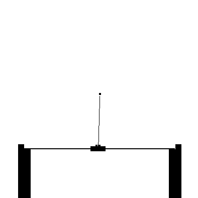

# Gym
   
AI Gym for Clojure

Provides a classic CartPole like environment.
Runs on a very simple game engine built using dyn4j and some java2d.

## Run

Usually used as a lib, but for development there is
a runnable example which can be controlled manually

    clj -M -m gym.envs.cartpole
